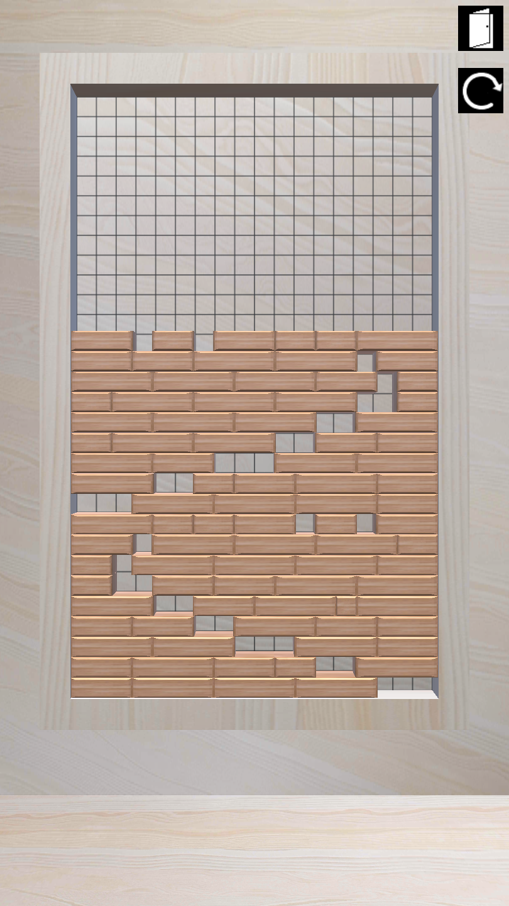

# ~英雄与地下城？？~

更新：

 - 添加了简单的 UI 和标题界面，使用参数控制面板行数与列数
 - 添加了关卡选择界面
 - 添加了退出游戏、重新尝试按钮
 - 添加了高亮提醒（把颜色的 RGB 设置为大于 1 竟然就能实现高亮。。。）
 - 添加了音效
 - 添加了简单的胜利界面

大概已经有这个游戏了，但这个游戏肯定不叫下面截图中的这个名字……

借鉴结果如下：

这一关只需要移动两个木块即可通关。

之前写的测试关卡：

关卡文件格式：

若干个 byte 数字，

前两个数字分别表示列数与行数，对于后续数字：

 - 数字 `x` 为正表示该位置有一个长度为 `x` 的木块；
 - 数字 `x` 为负表示该位置有一个长度为 `-x` 的空缺；
 - 数字 `x` 为 0 表示换到下一行（上一层）。
